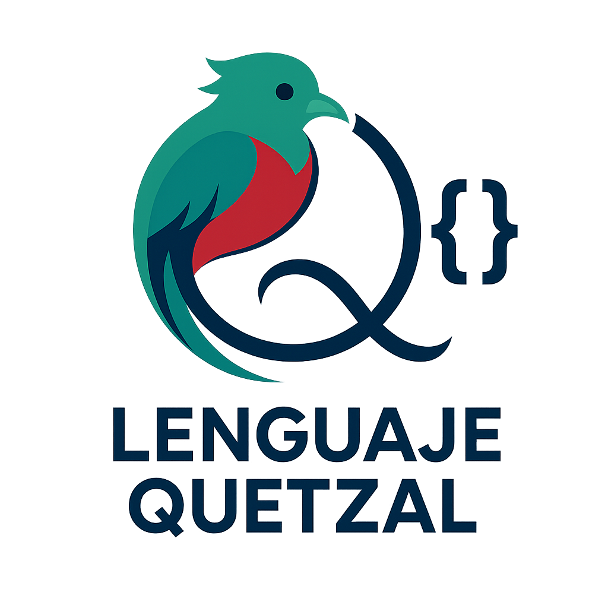

<div align="center">
  
  
  # Extensión Lenguaje Quetzal para VS Code
  
  **Soporte completo para el lenguaje de programación Quetzal**
  
  [](package.json)
  [](https://code.visualstudio.com/)
  [](https://www.typescriptlang.org/)
  [](LICENSE)
  
  *Un lenguaje de programación interpretado con sintaxis en español, diseñado para ser intuitivo y fácil de aprender*
</div>

---

## 🌟 Características Principales

### 🎨 **Resaltado de Sintaxis Avanzado**
- Reconocimiento completo de palabras reservadas en español
- Coloreado diferenciado para tipos, funciones, variables y objetos
- Soporte para comentarios de línea `//` y bloque `/* */`
- Resaltado especial para cadenas con templates `c"texto {variable}"`

### ⚡ **Autocompletado Inteligente**
- Sugerencias automáticas para palabras reservadas y tipos de datos
- Completado contextual de funciones y variables definidas por el usuario
- Snippets predefinidos para estructuras comunes del lenguaje
- Información detallada al hacer hover sobre elementos

### 🔧 **Formateador de Código**
- Formateo automático con sangría inteligente
- Espaciado correcto alrededor de operadores
- Configuración personalizable de espacios de sangría
- Comando dedicado: `Formatear Documento Quetzal`

### 🔍 **Diagnósticos en Tiempo Real**
- Detección automática de errores de sintaxis
- Validación de llaves `{}` y paréntesis `()` balanceados
- Verificación de convenciones de nomenclatura (snake_case)
- Advertencias sobre puntos y comas innecesarios

### 🎨 **Tema Personalizado**
- "Tema Quetzal Oscuro" optimizado para el lenguaje
- Colores específicos para cada tipo de token sintáctico
- Diseño que mejora la legibilidad del código

---

## 🚀 Instalación

### Desde VS Code Marketplace
1. Abre Visual Studio Code
2. Ve a la pestaña de Extensiones (`Ctrl+Shift+X`)
3. Busca "Lenguaje Quetzal"
4. Haz clic en "Instalar"

### Instalación Manual
1. Descarga el archivo `.vsix` desde las releases
2. En VS Code: `Ctrl+Shift+P` → "Extensiones: Instalar desde VSIX..."
3. Selecciona el archivo descargado

---

## 📝 Sintaxis del Lenguaje Quetzal

### Tipos de Datos Básicos
```qz
// Tipos fundamentales
entero edad = 25
número altura = 1.75
cadena nombre = "Ana García"
bool es_estudiante = verdadero
lista<cadena> materias = ["Matemáticas", "Programación"]
jsn configuracion = {tema: "oscuro", version: "1.0"}
vacio sin_valor
```

### Variables Mutables
```qz
// Variables que pueden cambiar de valor
entero mut contador = 0
cadena mut mensaje = "texto inicial"
```

### Funciones
```qz
// Función con retorno
entero calcular_suma(entero a, entero b) {
    retornar a + b
}

// Función sin retorno
vacio mostrar_mensaje(cadena texto) {
    imprimir("Mensaje: " + texto)
}
```

### Estructuras de Control
```qz
// Condicionales
si (edad >= 18) {
    imprimir("Mayor de edad")
} sino si (edad >= 13) {
    imprimir("Adolescente")
} sino {
    imprimir("Menor de edad")
}

// Bucles
mientras (contador < 10) {
    imprimir("Contador: " + contador.cadena())
    contador++
}

para (entero i = 0; i < 5; i++) {
    imprimir("Iteración: " + i.cadena())
}

para (elemento en lista) {
    imprimir("Elemento: " + elemento.cadena())
}
```

### Objetos
```qz
objeto Persona {
    publico:
        cadena nombre
        entero edad
        
        Persona(cadena n, entero e) {
            ambiente.nombre = n
            ambiente.edad = e
        }
        
        vacio saludar() {
            imprimir("Hola, soy " + ambiente.nombre)
        }
    
    privado:
        cadena id = "PER-001"
}

// Uso del objeto
Persona juan = nuevo Persona("Juan López", 30)
juan.saludar()
```

---

## ⚙️ Configuración

La extensión incluye múltiples opciones configurables:

```json
{
    "quetzal.formateador.habilitado": true,
    "quetzal.formateador.sangría": 4,
    "quetzal.autocompletado.habilitado": true,
    "quetzal.diagnosticos.habilitado": true
}
```

### Opciones Disponibles

| Configuración | Tipo | Por Defecto | Descripción |
|---------------|------|-------------|-------------|
| `quetzal.formateador.habilitado` | boolean | `true` | Habilita el formateador automático |
| `quetzal.formateador.sangría` | number | `4` | Espacios para la sangría |
| `quetzal.autocompletado.habilitado` | boolean | `true` | Habilita autocompletado |
| `quetzal.diagnosticos.habilitado` | boolean | `true` | Habilita diagnósticos de errores |

---

## 🎯 Comandos Disponibles

| Comando | Descripción | Atajo |
|---------|-------------|-------|
| `Formatear Documento Quetzal` | Formatea el archivo .qz actual | `Ctrl+Shift+P` |
| `Ejecutar Archivo Quetzal` | Envía el archivo al terminal | Menú contextual |

---

## 📦 Snippets Incluidos

| Prefijo | Descripción | Genera |
|---------|-------------|--------|
| `funcion` | Función básica | `tipo nombre_funcion(parametros) { ... }` |
| `si` | Condicional | `si (condición) { ... }` |
| `mientras` | Bucle while | `mientras (condición) { ... }` |
| `para` | Bucle for | `para (var = 0; condición; incremento) { ... }` |
| `objeto` | Objeto básico | `objeto NombreObjeto { publico: ... }` |
| `imprimir` | Función print | `imprimir("mensaje")` |
| `mut` | Variable mutable | `tipo mut variable = valor` |

---

## 🔨 Desarrollo

### Requisitos
- Node.js 18+
- TypeScript 5.0+
- Visual Studio Code 1.80.0+

### Configuración Local
```bash
# Clonar repositorio
git clone [URL_DEL_REPOSITORIO]
cd lenguaje-quetzal-vscode-extension

# Instalar dependencias
npm install

# Compilar código
npm run compile

# Ejecutar en modo desarrollo
# Presionar F5 en VS Code
```

### Empaquetar Extensión
```bash
# Instalar herramienta de empaquetado
npm install -g vsce

# Crear paquete .vsix
vsce package
```

---

## 🤝 Contribuir

¡Las contribuciones son bienvenidas! Por favor:

1. Fork el repositorio
2. Crea una rama para tu característica (`git checkout -b caracteristica/nueva-funcionalidad`)
3. Commit tus cambios (`git commit -am 'Agrega nueva funcionalidad'`)
4. Push a la rama (`git push origin caracteristica/nueva-funcionalidad`)
5. Abre un Pull Request

---

## 📄 Licencia

Este proyecto está bajo la **Licencia AntaresGT**. 

### Términos Principales:
- ✅ **Permitido**: Usar, modificar, distribuir y crear forks
- ✅ **Libre para uso comercial y personal**
- ⚠️ **Requisito obligatorio**: Atribución clara a AntaresGT en todos los usos
- ⚠️ **Los forks deben indicar**: "Basado en el trabajo original de AntaresGT"

### Atribución Requerida:
Cualquier uso, modificación o fork debe incluir prominentemente:
```
"Basado en el trabajo original de AntaresGT (https://antaresgt.com)"
"Software original desarrollado por Allam López - AntaresGT"
```

Para más detalles, consulta el archivo [LICENSE](LICENSE).

**Contacto para permisos especiales:** alan@antaresgt.com

---

## 🗂️ Estructura del Proyecto

```
lenguaje-quetzal-vscode-extension/
├── 📁 src/                          # Código fuente TypeScript
│   ├── extension.ts                 # Punto de entrada principal
│   ├── servidor_lenguaje.ts         # Servidor de lenguaje
│   ├── formateador.ts              # Formateador de código
│   ├── proveedor_completado.ts     # Autocompletado
│   └── diagnosticador.ts           # Diagnósticos
├── 📁 syntaxes/                     # Gramática de sintaxis
│   └── quetzal.tmLanguage.json     # Definición de tokens
├── 📁 snippets/                     # Snippets predefinidos
│   └── quetzal.json                # Plantillas de código
├── 📁 themes/                       # Temas de color
│   └── quetzal-dark-theme.json     # Tema oscuro
├── 📁 imagenes/                     # Recursos gráficos
├── 📄 package.json                  # Configuración de la extensión
├── 📄 language-configuration.json   # Configuración del lenguaje
└── 📄 README.md                     # Este archivo
```

---

## 🔗 Enlaces Útiles

- [Documentación de VS Code API](https://code.visualstudio.com/api)
- [Guía de Desarrollo de Extensiones](https://code.visualstudio.com/api/get-started/your-first-extension)
- [TextMate Grammar](https://macromates.com/manual/en/language_grammars)

---

<div align="center">
  
  **¿Te gusta el proyecto? ¡Dale una ⭐!**
  
  ---
  
  ### 🏢 Desarrollado por AntaresGT
  
  **Empresa:** AntaresGT  
  **Desarrollador:** Allam López  
  **Email:** alan@antaresgt.com  
  **Web:** https://antaresgt.com
  
  *Tecnología innovadora desarrollada en Guatemala con ❤️*
  
  ---
  
  **Si usas este proyecto, por favor incluye la atribución requerida:**  
  *"Basado en el trabajo original de AntaresGT"*
  
</div>
Extensión de VSCode para el lenguaje Quetzal
